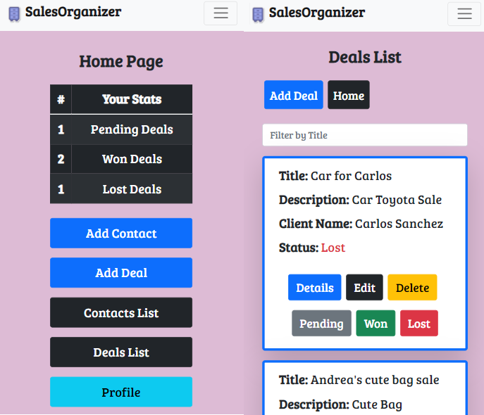

# SalesOrganizer boilerplate

### Front-End Activation

Run these commands to start the front-end:

rm -rf node_modules &&
nvm install 14 && npm install &&
cp ./.env.example ./.env &&
echo "BACKEND_URL=https://3001-${GITPOD_WORKSPACE_URL:8}" >> .env &&
npm run start

### Back-End Activation

Run this command to start the back-end:

pipenv run start
